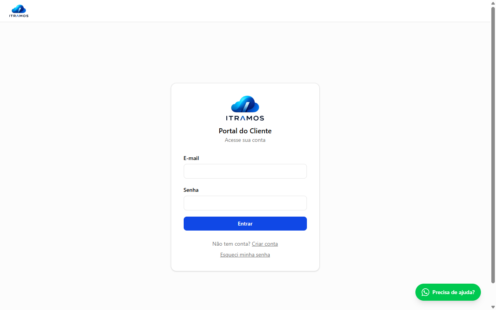
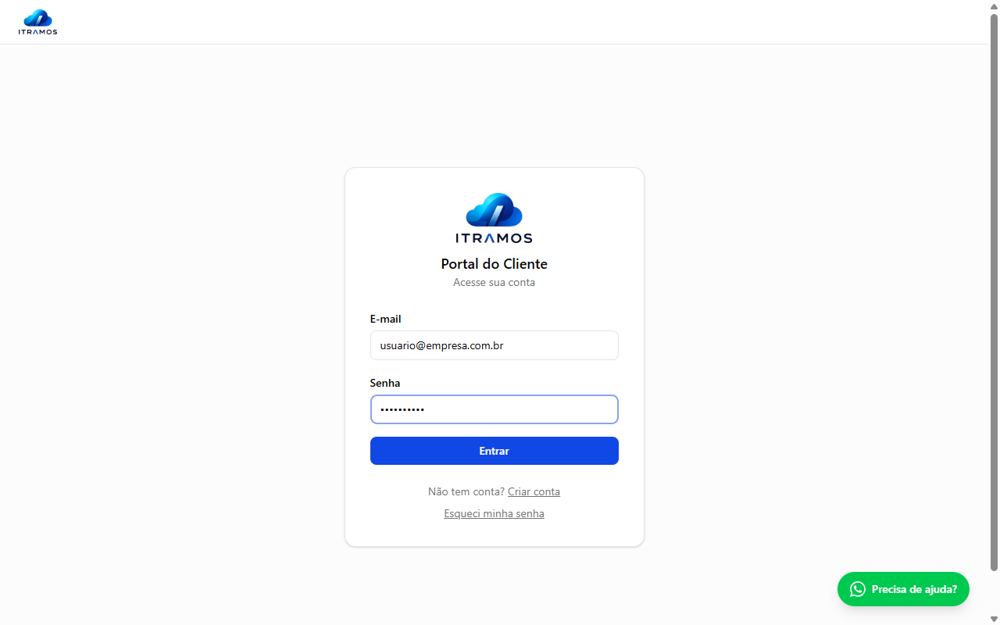
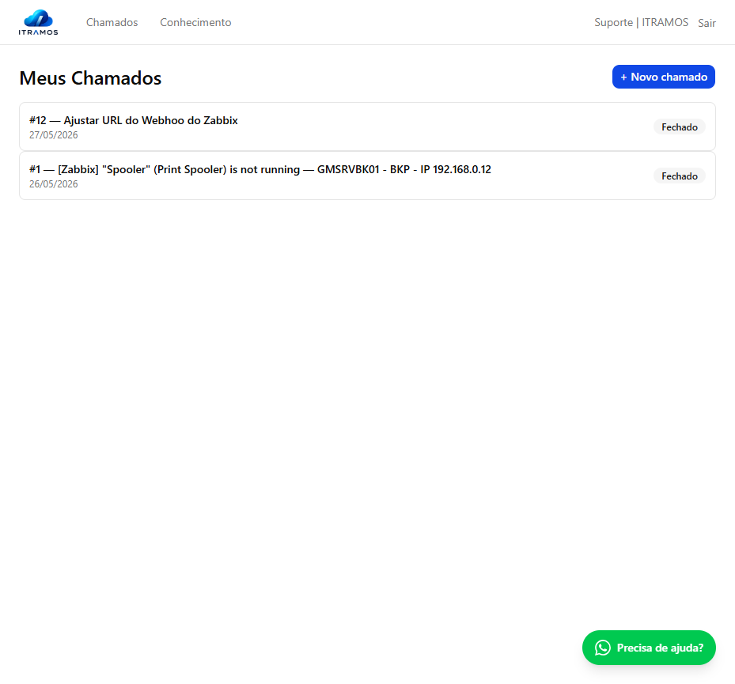
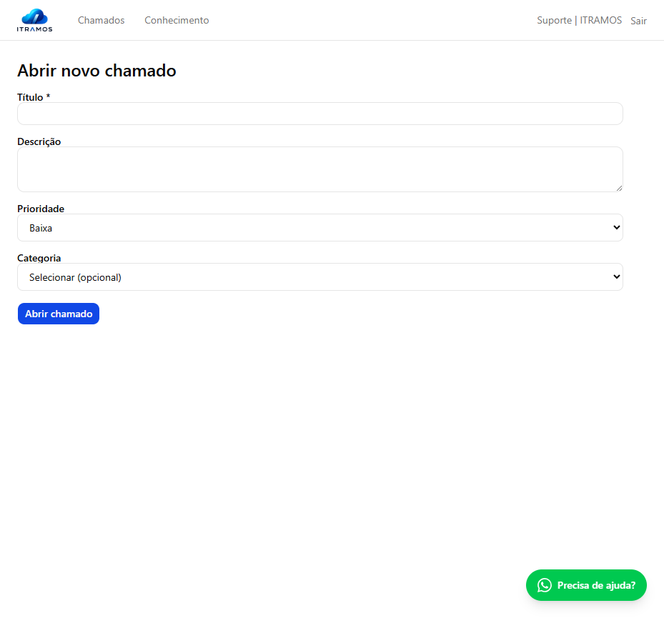
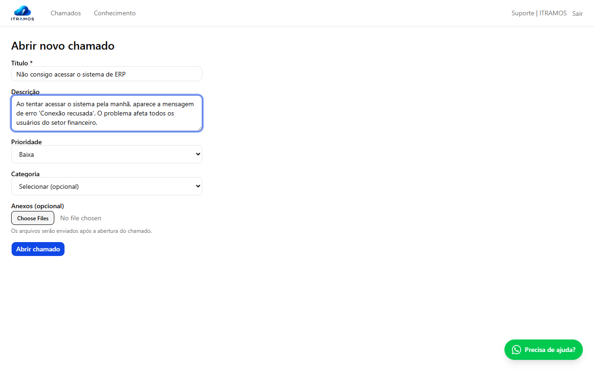
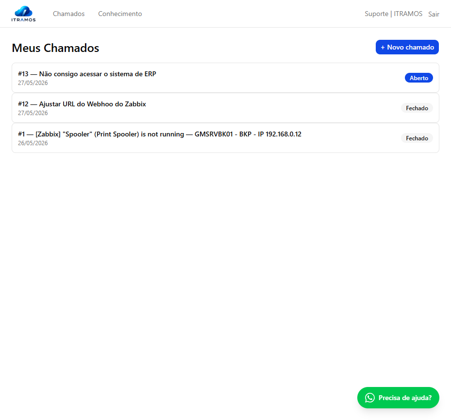
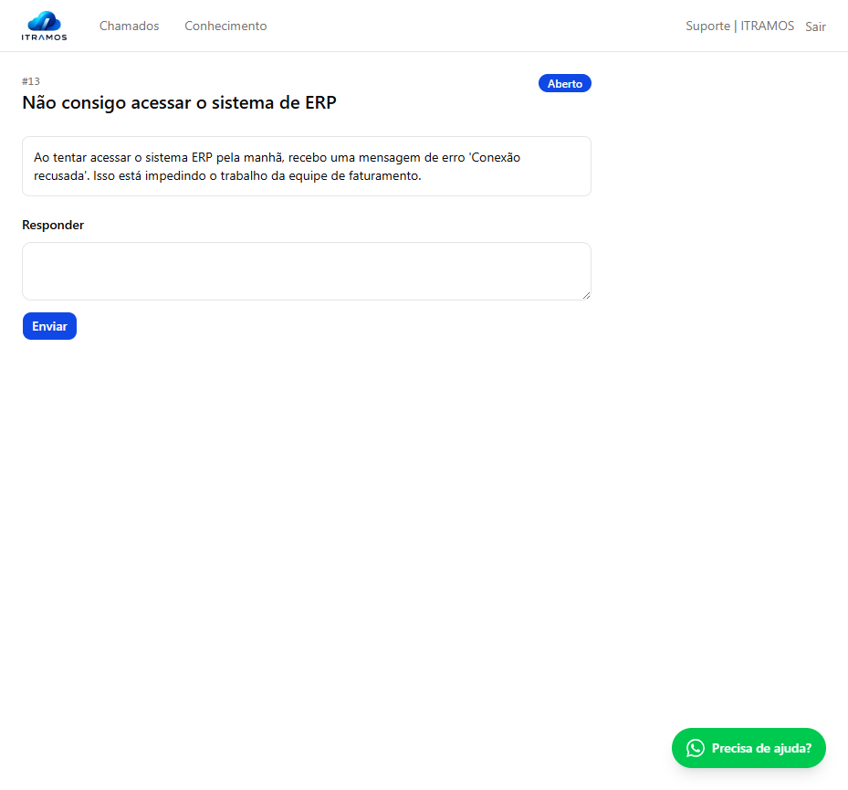
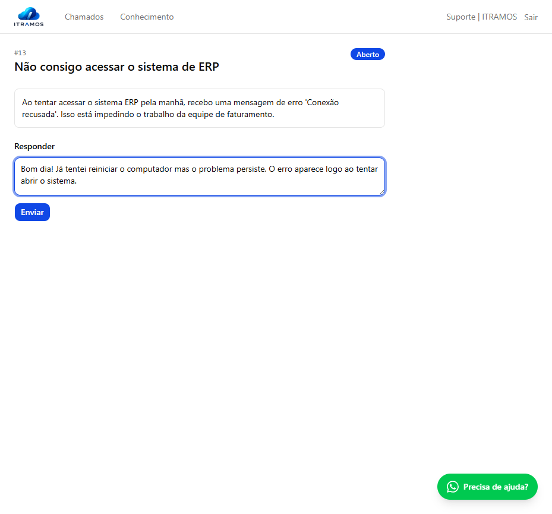
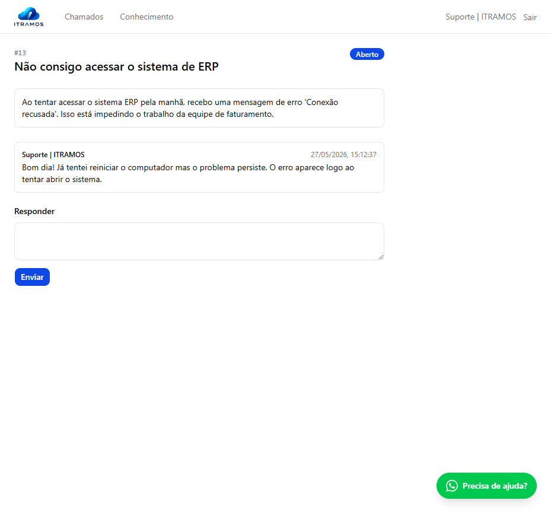
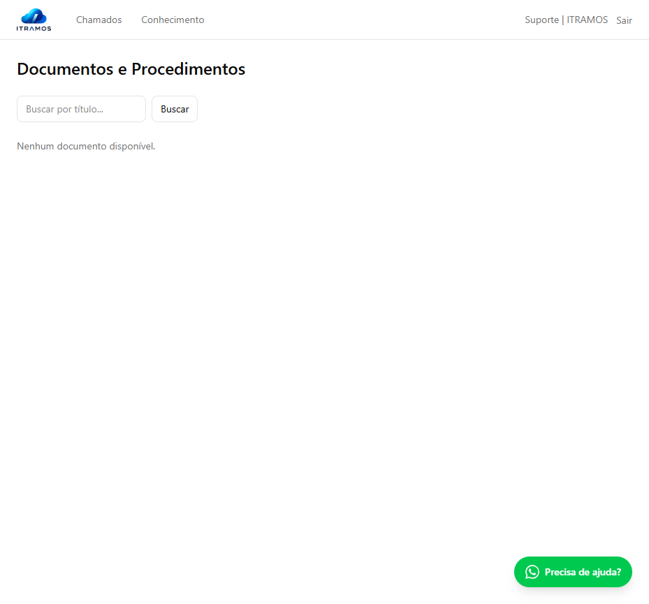

# Guia do Cliente — Portal de Suporte ITRAMOS

Bem-vindo ao Portal de Suporte da ITRAMOS! Este guia explica, passo a passo, como acessar o sistema, abrir chamados de suporte e acompanhar o atendimento.

---

## Índice

1. [Acessando o Portal](#1-acessando-o-portal)
2. [Tela Inicial — Lista de Chamados](#2-tela-inicial--lista-de-chamados)
3. [Abrindo um Novo Chamado](#3-abrindo-um-novo-chamado)
4. [Acompanhando um Chamado](#4-acompanhando-um-chamado)
5. [Respondendo / Interagindo em um Chamado](#5-respondendo--interagindo-em-um-chamado)
6. [Base de Conhecimento](#6-base-de-conhecimento)
7. [Precisa de Ajuda Imediata?](#7-precisa-de-ajuda-imediata)

---

## 1. Acessando o Portal

Acesse o portal pelo endereço: **https://tickets.itramos.com.br/portal/login**

Na tela de login:

1. Digite seu **e-mail** no primeiro campo
2. Digite sua **senha** no segundo campo
3. Clique no botão **Entrar**

> **Esqueceu a senha?** Clique no link **"Esqueci minha senha"** abaixo do botão Entrar e informe seu e-mail. Você receberá um link para criar uma nova senha.

Após o login, você será direcionado automaticamente para a lista dos seus chamados.

---

## 2. Tela Inicial — Lista de Chamados

Ao entrar no portal, você verá a lista com todos os seus chamados abertos e históricos.

Cada chamado exibe:
- **Número** — identificador único (ex: `#13`)
- **Título** — resumo do problema relatado
- **Data de abertura**
- **Status** — situação atual do chamado (veja os status abaixo)

### Status possíveis

| Status | Significado |
|---|---|
| **Aberto** | Chamado registrado, aguardando atendimento |
| **Em andamento** | Técnico está trabalhando no chamado |
| **Ag. cliente** | Aguardando uma resposta ou informação sua |
| **Ag. fornecedor** | Aguardando resposta de um fornecedor externo |
| **Resolvido** | Solução aplicada, aguardando sua confirmação |
| **Fechado** | Chamado encerrado |

> **Dica:** Clique em qualquer chamado da lista para ver os detalhes e o histórico de interações.

---

## 3. Abrindo um Novo Chamado

Para registrar um novo problema ou solicitação:

1. Na tela de chamados, clique no botão **+ Novo chamado** (canto superior direito)

2. Preencha o formulário:

   - **Título** *(obrigatório)*: Descreva brevemente o problema em uma frase.  
     Exemplo: *"Não consigo acessar o sistema de ERP"*

   - **Descrição**: Detalhe o problema — quando começou, o que você tentou fazer, mensagens de erro que apareceram, quais usuários são afetados.

   - **Prioridade**: Indique a urgência do chamado:
     - **Baixa** — Problema que não impede o trabalho
     - **Média** — Situação que atrapalha mas tem alternativa
     - **Alta** — Impacto significativo nas operações
     - **Crítica** — Paralisação total ou perda de dados

   - **Categoria** *(opcional)*: Selecione o tipo de solicitação mais adequado.

   - **Anexos** *(opcional)*: Clique em **Escolher arquivos** para anexar prints de tela, logs, documentos ou qualquer arquivo que ajude a descrever o problema. É possível selecionar múltiplos arquivos de uma vez.  
     > Limite de **10 MB por arquivo**. Os arquivos são enviados automaticamente após o chamado ser criado.

3. Clique em **Abrir chamado**

O sistema criará o chamado e enviará os arquivos em seguida — enquanto o upload ocorre, o botão exibe **"Enviando arquivos..."**. Aguarde até ser redirecionado para a lista de chamados.

O chamado será registrado e você retornará para a lista. Você também receberá uma **confirmação por e-mail** com os dados do chamado e o número para acompanhamento.

---

## 4. Acompanhando um Chamado

Clique em qualquer chamado da lista para abrir os detalhes.

Na tela de detalhes você encontra:

- **Número e título** do chamado
- **Status atual**
- **Descrição** que você informou na abertura
- **Histórico de interações** — todas as mensagens trocadas entre você e a equipe de suporte

Você também receberá **notificações por e-mail** sempre que houver uma atualização no chamado (nova resposta, mudança de status, resolução).

---

## 5. Respondendo / Interagindo em um Chamado

Sempre que a equipe de suporte enviar uma mensagem ou solicitar informações adicionais, você pode responder diretamente pelo portal:

1. Abra o chamado desejado
2. Role até o final da página e localize o campo **"Responder"**
3. Digite sua mensagem com as informações solicitadas

4. Clique em **Enviar**

Sua mensagem será registrada no histórico do chamado e a equipe de suporte será notificada automaticamente.

> **Importante:** Se o chamado estiver com o status **"Ag. cliente"**, isso significa que a equipe aguarda uma resposta sua. Ao enviar sua mensagem, o status voltará para **Em andamento** automaticamente.

---

## 6. Base de Conhecimento

O portal conta com uma **Base de Conhecimento** onde você pode encontrar artigos, tutoriais e respostas para dúvidas frequentes — sem precisar abrir um chamado.

Para acessar, clique em **Conhecimento** no menu superior.

Utilize o campo de busca para encontrar artigos relacionados ao seu problema. Se não encontrar a resposta, abra um chamado normalmente.

---

## 7. Precisa de Ajuda Imediata?

Para situações urgentes, você pode entrar em contato com nossa equipe diretamente pelo **WhatsApp**. Clique no botão **"Precisa de ajuda?"** localizado no canto inferior da tela.

> **Suporte ITRAMOS**  
> E-mail: chamados@itramos.com.br  
> WhatsApp: (11) 98877-2800  
> Portal: https://tickets.itramos.com.br/portal/login

---

*Atualizado em 28/05/2026 — ITRAMOS Tecnologia*
